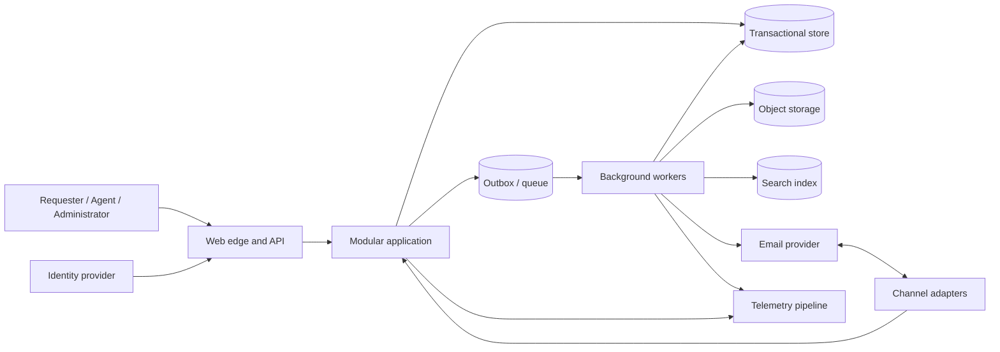
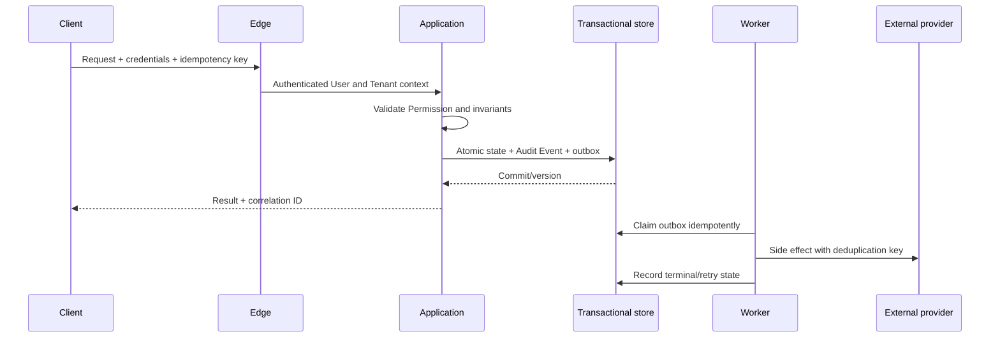

# Architecture

## Context and containers

The initial architecture is a stateless, horizontally scalable modular monolith plus workers (ADR-001). Bounded contexts are Identity & Access, Tenant Administration, Ticketing, Automation, SLA, Communications, Search & Reporting, Audit, and Platform Operations. Calls across modules use explicit application contracts; only the owning module mutates its data.

## Request and event path

## Architecture rules

- Transactional state is authoritative; search, caches, analytics, and notifications are projections.
- External effects never occur inside the state transaction. Consumers are at-least-once and idempotent.
- Optimistic concurrency protects aggregates; bounded retries apply only to safe operations.
- Backpressure, quotas, circuit breakers, timeouts, and dead-letter review prevent cascading failure.
- No synchronous dependency is added to the Ticket write path without an availability and latency review.

See [ADR entries](decision-log.md), [data model](12-data-model.md), and [NFRs](15-non-functional-requirements.md).
