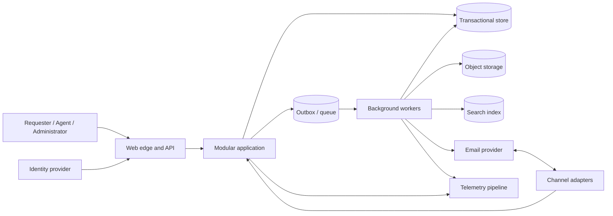
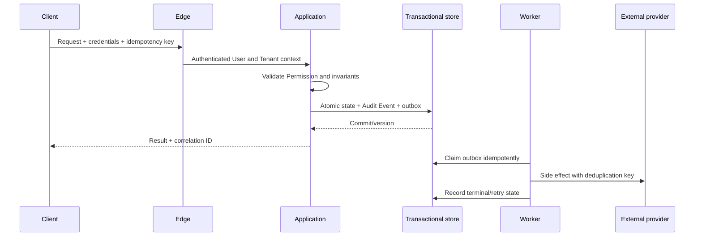

# Architecture

## Context and containers

The initial architecture is a stateless, horizontally scalable modular monolith plus workers (see [decision log](decision-log.md) and [ADR records](adr/README.md)). Bounded contexts are Identity & Access, Tenant Administration, Ticketing, Automation, SLA, Communications, Search & Reporting, Audit, and Platform Operations. Calls across modules use explicit application contracts; only the owning module mutates its data.

## Request and event path

## Architecture rules

- Transactional state is authoritative; search, caches, analytics, and notifications are projections.
- External effects never occur inside the state transaction. Consumers are at-least-once and idempotent.
- Optimistic concurrency protects aggregates; bounded retries apply only to safe operations.
- Backpressure, quotas, circuit breakers, timeouts, and dead-letter review prevent cascading failure.
- No synchronous dependency is added to the Ticket write path without an availability and latency review.

## Bounded context responsibilities

| Context               | Owns                                                                             | Must not own                                                     |
| --------------------- | -------------------------------------------------------------------------------- | ---------------------------------------------------------------- |
| Identity & Access     | Users, sessions, tenant memberships, roles, permissions, MFA/SSO adapters.       | Ticket workflow rules or tenant business configuration.          |
| Tenant Administration | Tenant lifecycle, settings, domains, branding, quotas, support access policy.    | Platform-wide controls.                                          |
| Ticketing             | Tickets, comments, attachments, assignment, tags, custom fields, ticket links.   | Notification delivery attempts or search indexes as authorities. |
| Automation            | Workflow definitions, workflow versions, executions, action attempts.            | Arbitrary customer code execution.                               |
| SLA                   | Business schedules, SLA policies, targets, evaluations, warnings, breaches.      | Ticket status authority outside allowed transition commands.     |
| Communications        | Notification intents, templates, preferences, provider attempts, email messages. | Tenant permission decisions.                                     |
| Search & Reporting    | Search projections, report aggregates, export jobs.                              | Source-of-truth authorization or domain mutation.                |
| Audit                 | Audit event persistence, access, export evidence, integrity controls.            | Mutable business state.                                          |
| Platform Operations   | Health, runbooks, outbox operations, operator elevation, recovery workflows.     | Tenant content access without approved elevation.                |

## Architecture control catalogue

| Control                         | Requirement                                                                                                                                                        |
| ------------------------------- | ------------------------------------------------------------------------------------------------------------------------------------------------------------------ |
| ARC-01 Module boundaries        | Each bounded context owns its data and exposes explicit application contracts. Cross-context persistence writes are prohibited.                                    |
| ARC-02 Transactional authority  | Transactional domain state is authoritative; projections are rebuildable and disclose freshness.                                                                   |
| ARC-03 Outbox side effects      | Domain state, Audit Event, and outbox intent commit atomically; external effects are asynchronous and idempotent.                                                  |
| ARC-04 Deterministic automation | Workflow/SLA/notification automation executes against immutable event snapshots, versioned configuration, bounded retries, deduplication keys, and audit evidence. |
| ARC-05 Compatible evolution     | API, schema, configuration, and event changes use documented versioning and expand/migrate/contract migration strategy before removal.                             |

See [ADR entries](decision-log.md), [detailed ADR records](adr/README.md), [database design](database/README.md), [API specification](api/README.md), and [NFRs](15-non-functional-requirements.md).
