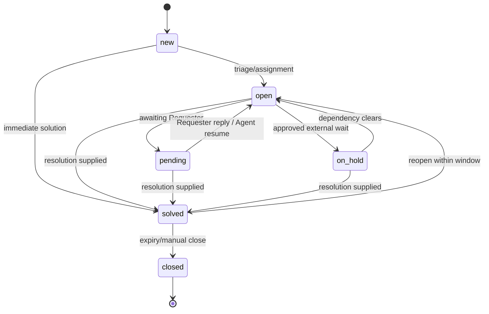

# Ticket lifecycle and workflows

The detailed transition, approval, SLA, automation, and notification contract is [workflow-matrix.md](workflow-matrix.md).

## Status model

`closed` is terminal; follow-up creates a linked Ticket. Solving requires a public resolution unless a Tenant policy permits and audits an internal-only resolution. Status, assignment, priority, tags, and custom fields change under optimistic concurrency. Duplicate inbound messages are deduplicated by provider/message identity.

## Workflow engine

A Workflow has draft/published/retired state, immutable published version, priority, trigger Domain Event types, conditions, ordered actions, owner, and execution limits. Matching versions are evaluated in priority order against an event snapshot. Actions include assignment, field/status change, tag, notification request, and delayed follow-up—never arbitrary code.

Rules: validate references and transition legality at publication; cap chained executions and actions; detect cycles; use a deterministic evaluation clock; deduplicate by event/workflow-version/action; record inputs, matched conditions, actions, outcome, and error; dead-letter exhausted failures; and never silently skip. Workflow writes emit new Domain Events only after commit.

## Acceptance criteria

Concurrent edits produce one winner and a conflict response. Invalid transitions leave state unchanged. Replaying the same event produces no duplicate effect. Publishing a new Workflow version does not change in-flight or historical evaluation. Operators can pause a faulty Workflow without deleting evidence.
