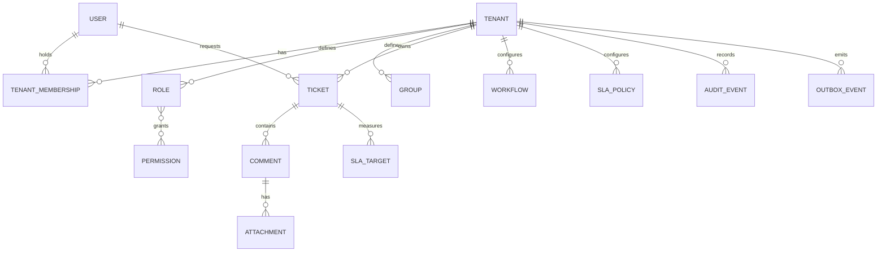

# Conceptual data model

This document defines entities and invariants, not SQL, migrations, or vendor types. The expanded database blueprint is in [database/](database/README.md).

## Entities and constraints

- **Tenant:** immutable identity, unique canonical slug, lifecycle state, configuration version.
- **User:** global identity and verified identifiers; Tenant access exists only through unique `(tenant_id, user_id)` Tenant Membership.
- **Tenant Membership/Role/Permission/Group:** all assignments refer to the same Tenant; last active administrator cannot be removed.
- **Ticket:** Tenant, immutable public reference unique within Tenant, Requester, Channel, status, priority, assignment, version, timestamps. References (including Organization, Group, Agent) must share Tenant.
- **Comment:** belongs to exactly one Ticket and Tenant; author, visibility, body representation, source identity, and created time are immutable. Provider source identity is unique within Tenant/channel.
- **Attachment:** belongs to Comment/Ticket/Tenant; immutable content hash, size, media type, storage identity, and scan state. Download requires `clean` state.
- **Workflow/SLA Policy/Business Schedule/template:** mutable drafts and immutable, uniquely numbered published versions; historical evaluations reference a version.
- **SLA Target:** Ticket, type, policy/schedule versions, start/due/completion instants, accumulated pause, state, and version; one active Target per Ticket/type/policy application.
- **Audit Event:** append-only identity, Tenant, actor type/id, action, target, outcome, safe change metadata, IP/device context where permitted, correlation, and instant.
- **Outbox Event/notification attempt:** immutable deduplication identity; state transitions are monotonic and attempts are retained per policy.

Deletion uses explicit retention state; hard deletion never breaks required audit or legal-hold evidence. Cross-entity constraints are enforced in both domain and persistence layers. See [migration policy](18-deployment-cicd.md).
