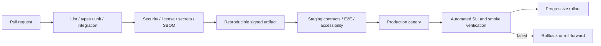

# Deployment, CI/CD, and rollback

## Pipeline

Artifacts are immutable, content-addressed, signed, provenance-attested, and promoted—not rebuilt—between environments. Production requires protected approvals, separation of duties, change record, and no shared human credentials. Configuration and feature flags are versioned, validated, least-privilege, and free of embedded secrets.

## Release policy

Use progressive delivery by Tenant-safe cohorts. Automatic halt/rollback triggers include SLO burn, error/latency regression, isolation/auth anomaly, migration error, audit loss, or smoke failure. Feature flags need owner, purpose, safe default, expiry, and removal plan; flags are not authorization.

## Migration and rollback

Use expand/migrate/contract: deploy readers/writers compatible with old and new shapes; expand; run checkpointed, throttled, observable Tenant-aware backfill; validate invariants/counts; switch; wait through rollback window; contract in a later release. Snapshot/backup and restore validation precede irreversible operations. Prefer roll-forward for data transformations; application rollback is required while schemas remain compatible. Stop-the-world, unbounded locks, destructive same-release changes, and silent partial backfills are prohibited.

Each production release records artifact, schema/config versions, approvals, tests, migration progress, cohort, dashboards, and rollback decision. Quarterly rollback drills and at least annual full recovery exercises validate policy.
