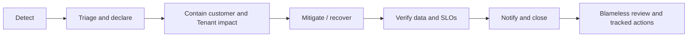

# Operations and recovery

## Service ownership

Every production module, queue, datastore, and vendor has an owner, SLO, dashboard, alert, dependency map, runbook, capacity threshold, and escalation. On-call handoffs include active incidents, risky changes, error budget, and delayed jobs.

## Incident lifecycle

Security and privacy incidents follow SEC-10 and legal notification assessment. Never move Tenant content into chat or tickets lacking authorization. Severity is based on customer scope, isolation, data integrity, availability, and recoverability. Status communications state known impact, mitigation, and next update without speculation.

## Continuity

Backups are encrypted, access-controlled, immutable where supported, monitored, and restored in routine tests. Recovery validates application integrity, Tenant ownership, Audit Events, outbox continuity, search rebuild, and notification deduplication. Baseline RPO/RTO are NFR-06 pending OQ-14; quarterly component restore and annual disaster recovery exercises measure actual results.

Error-budget policy: at ≥50% monthly budget consumption pause risky changes and investigate; at 100% allow only reliability/security work until owner and product approve recovery. Capacity review begins at 60% sustained limit; remediation is ready before 75%. Vendor outage runbooks cover degraded mode, queue bounds, replay, reconciliation, and communication.
