# Entity relationship design

This ERD is conceptual and vendor-neutral. It expands [../12-data-model.md](../12-data-model.md) and supports the API surface in [../api/README.md](../api/README.md).

```mermaid
erDiagram
  TENANT ||--o{ TENANT_SETTING : configures
  TENANT ||--o{ TENANT_DOMAIN : owns
  TENANT ||--o{ ORGANIZATION : groups
  TENANT ||--o{ USER_ROLE : grants_M2
  USER ||--o{ USER_ROLE : receives_M2
  USER_ROLE }o--|| ROLE : assigns_M2
  TENANT ||--o{ ROLE : defines
  ROLE }o--o{ PERMISSION : grants
  USER ||--o{ USER_PROFILE : has
  USER ||--o{ USER_PREFERENCE : stores
  USER ||--o{ SESSION : opens
  SESSION ||--o{ REFRESH_TOKEN : rotates
  TENANT ||--o{ GROUP : defines
  GROUP }o--o{ TENANT_MEMBERSHIP : includes

  TENANT ||--o{ TICKET : owns
  ORGANIZATION ||--o{ TICKET : contextualizes
  USER ||--o{ TICKET : requests
  GROUP ||--o{ TICKET : assigned_group
  TENANT_MEMBERSHIP ||--o{ TICKET : assigned_agent
  TICKET ||--o{ COMMENT : contains
  COMMENT ||--o{ ATTACHMENT : has
  TICKET ||--o{ TICKET_LINK : relates
  TICKET ||--o{ TICKET_WATCHER : notifies
  TICKET ||--o{ TICKET_FIELD_VALUE : extends
  TENANT ||--o{ TICKET_FIELD_DEFINITION : defines

  TENANT ||--o{ WORKFLOW : configures
  WORKFLOW ||--o{ WORKFLOW_VERSION : publishes
  WORKFLOW_VERSION ||--o{ WORKFLOW_EXECUTION : executes
  WORKFLOW_EXECUTION ||--o{ WORKFLOW_ACTION_ATTEMPT : performs

  TENANT ||--o{ BUSINESS_SCHEDULE : defines
  BUSINESS_SCHEDULE ||--o{ BUSINESS_SCHEDULE_VERSION : publishes
  TENANT ||--o{ SLA_POLICY : configures
  SLA_POLICY ||--o{ SLA_POLICY_VERSION : publishes
  TICKET ||--o{ SLA_TARGET : measures
  SLA_TARGET ||--o{ SLA_EVALUATION : evidences

  TENANT ||--o{ NOTIFICATION_TEMPLATE : owns
  NOTIFICATION_TEMPLATE ||--o{ NOTIFICATION_TEMPLATE_VERSION : publishes
  TENANT ||--o{ NOTIFICATION_PREFERENCE : stores
  TENANT ||--o{ NOTIFICATION_INTENT : emits
  NOTIFICATION_INTENT ||--o{ NOTIFICATION_ATTEMPT : sends
  TENANT ||--o{ EMAIL_MESSAGE : receives

  TENANT ||--o{ AUDIT_EVENT : records
  TENANT ||--o{ OUTBOX_EVENT : emits
  TENANT ||--o{ EXPORT_JOB : exports
  TENANT ||--o{ RETENTION_POLICY : governs
  TENANT ||--o{ LEGAL_HOLD : preserves
  TENANT ||--o{ API_TOKEN : authorizes
  TENANT ||--o{ OPERATOR_ELEVATION : permits
```

## Ownership boundaries

- Tenant-owned: settings, domains, organizations, memberships, roles, groups, tickets, comments, attachments, workflows, schedules, SLA policies, notification configuration, audit events, outbox events, exports, retention policies, legal holds, and API tokens.
- Global but access-controlled: user identity, permissions catalogue, and platform operator identities. Authentication sessions and refresh tokens are tenant-scoped for M2 tenant-aware login.
- Derived/projection data: search indexes, report aggregates, notification attempts, and analytics. Projections must be rebuildable from authoritative tables and events.

## Relationship invariants

- A ticket requester may be a global user, but ticket access is granted only through tenant membership or verified requester ownership.
- M2 role assignments and role-permission grants must reference roles in the same tenant through composite role/tenant constraints.
- Assignment references must resolve to active membership/group records in the same tenant.
- Comments, attachments, SLA targets, field values, links, watchers, and notification intents must reference tickets in the same tenant.
- Published configuration versions are immutable. Historical evaluations reference the exact version used.
- Provider identifiers, inbound email IDs, webhook event IDs, notification dedupe keys, and idempotency keys must be unique within tenant and channel/provider scope.

## Future partitioning candidates

High-volume tables should be designed for future partitioning by `tenant_id`, time, or both:

- `tickets`
- `comments`
- `attachments`
- `audit_events`
- `outbox_events`
- `notification_attempts`
- `workflow_executions`
- `sla_evaluations`
- `email_messages`
- `export_jobs`

Partitioning must preserve tenant isolation, foreign-key strategy, backups, restore drills, and query performance.
