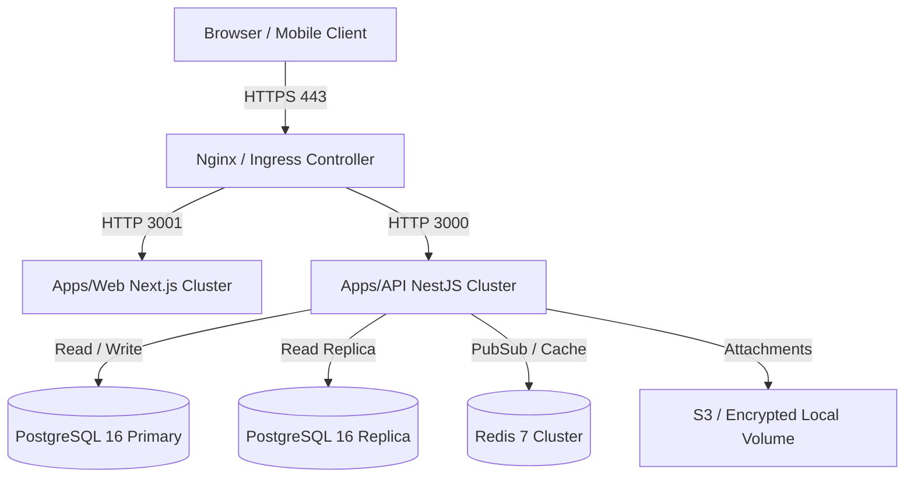

# SupportDesk Enterprise v1.0 — Deployment Guide

This guide details production deployment topologies, reverse proxy configurations, TLS termination, secret management, container orchestration (Kubernetes & Docker Compose), and CI/CD pipeline integration for SupportDesk Enterprise v1.0.

---

## 1. Production Architecture Topology



---

## 2. Reverse Proxy & TLS Configuration (Nginx)

Place the following configuration in `/etc/nginx/conf.d/supportdesk.conf`:

```nginx
server {
    listen 80;
    server_name supportdesk.example.com;
    return 301 https://$host$request_uri;
}

server {
    listen 443 ssl http2;
    server_name supportdesk.example.com;

    ssl_certificate /etc/letsencrypt/live/supportdesk.example.com/fullchain.pem;
    ssl_certificate_key /etc/letsencrypt/live/supportdesk.example.com/privkey.pem;
    ssl_protocols TLSv1.2 TLSv1.3;
    ssl_ciphers HIGH:!aNULL:!MD5;

    # Security Headers
    add_header Strict-Transport-Security "max-age=31536000; includeSubDomains" always;
    add_header X-Content-Type-Options "nosniff" always;
    add_header X-Frame-Options "DENY" always;
    add_header X-XSS-Protection "1; mode=block" always;

    # Web Frontend Routing
    location / {
        proxy_pass http://127.0.0.1:3001;
        proxy_http_version 1.1;
        proxy_set_header Upgrade $http_upgrade;
        proxy_set_header Connection 'upgrade';
        proxy_set_header Host $host;
        proxy_set_header X-Real-IP $remote_addr;
        proxy_set_header X-Forwarded-For $proxy_add_x_forwarded_for;
        proxy_set_header X-Forwarded-Proto $scheme;
    }

    # API Backend Routing
    location /api/ {
        proxy_pass http://127.0.0.1:3000;
        proxy_http_version 1.1;
        proxy_set_header Host $host;
        proxy_set_header X-Real-IP $remote_addr;
        proxy_set_header X-Forwarded-For $proxy_add_x_forwarded_for;
        proxy_set_header X-Forwarded-Proto $scheme;
        client_max_body_size 50M;
    }
}
```

---

## 3. Kubernetes Deployment (Helm Blueprint)

A sample Kubernetes manifest deployment structure is provided in `docker/k8s/`:

### Deployment Manifest (`api-deployment.yaml`)

```yaml
apiVersion: apps/v1
kind: Deployment
metadata:
  name: supportdesk-api
  namespace: supportdesk
spec:
  replicas: 3
  selector:
    matchLabels:
      app: supportdesk-api
  template:
    metadata:
      labels:
        app: supportdesk-api
    spec:
      containers:
        - name: api
          image: enterprise/supportdesk-api:v1.0.0
          ports:
            - containerPort: 3000
          envFrom:
            - secretRef:
                name: supportdesk-env-secrets
          resources:
            requests:
              memory: "512Mi"
              cpu: "250m"
            limits:
              memory: "2Gi"
              cpu: "1000m"
          livenessProbe:
            httpGet:
              path: /api/v1/health
              port: 3000
            initialDelaySeconds: 15
            periodSeconds: 10
```

---

## 4. Secret Management Best Practices

- **JWT Secrets & Encryption Keys**: Store in cloud key vaults (AWS Secrets Manager, HashiCorp Vault, or GCP Secret Manager). Never commit `.env` files or credentials to git.
- **Database Credentials**: Use least-privilege PostgreSQL user accounts with explicit schema access.
- **TLS Certificates**: Automate certificate management using `cert-manager` or AWS ACM.

---

## 5. Continuous Integration & Deployment (CI/CD)

The GitHub Actions pipeline (`.github/workflows/ci-cd.yml`) automates build, test, and release verification:

1. **Lint & Typecheck**: Enforces ESLint zero warnings and TypeScript `noEmit`.
2. **Unit & Integration Tests**: Runs all 454 unit and integration tests.
3. **Migration Drift Check**: Verifies Prisma migrations against target database.
4. **Container Build**: Builds and pushes multi-arch OCI images tagged with commit SHA and `v1.0.0`.
5. **Zero-Downtime Rolling Update**: Executes `kubectl rollout restart deployment/supportdesk-api`.
