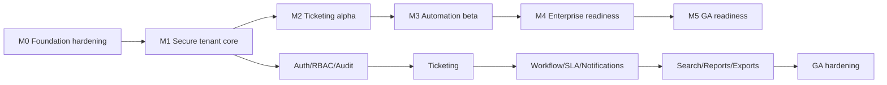

# GitHub project plan

This plan breaks implementation into issue-sized work after documentation readiness is approved. It is not source code. Dependencies align with [20-roadmap.md](20-roadmap.md). The complete Task 3 execution backlog is [github-backlog.md](github-backlog.md); sequencing is [implementation-order.md](implementation-order.md), [milestones.md](milestones.md), [sprint-plan.md](sprint-plan.md), [issue-templates.md](issue-templates.md), and [release-plan.md](release-plan.md).

## Milestones

| Milestone               | Goal                                                                              | Depends on |
| ----------------------- | --------------------------------------------------------------------------------- | ---------- |
| M0 Foundation hardening | Approve final architecture docs and close blocking open questions.                | None       |
| M1 Secure tenant core   | Tenant lifecycle, identity, membership, RBAC, audit, sessions.                    | M0         |
| M2 Ticketing alpha      | Ticket/comment/attachment core, requester portal, agent queues, email foundation. | M1         |
| M3 Automation beta      | Workflow, SLA, notifications, templates, schedules, approvals.                    | M2         |
| M4 Enterprise readiness | Search, reporting, exports, observability, performance, recovery, SSO target.     | M3         |
| M5 GA readiness         | Hardening, support operations, security review, rollout/rollback readiness.       | M4         |

## Labels

`area:api`, `area:auth`, `area:audit`, `area:database`, `area:docs`, `area:frontend`, `area:infra`, `area:notifications`, `area:security`, `area:testing`, `area:workflow`, `area:operations`, `kind:feature`, `kind:bug`, `kind:chore`, `kind:spike`, `risk:high`, `risk:tenant-isolation`, `risk:security`, `priority:critical`, `priority:high`, `priority:medium`, `priority:low`.

## Dependency graph

## Epics and issues

### M0 Foundation hardening

|   # | Issue                                                               | Labels                                   | Depends on |
| --: | ------------------------------------------------------------------- | ---------------------------------------- | ---------- |
|   1 | Resolve compliance targets and evidence scope.                      | `area:security`, `priority:critical`     | None       |
|   2 | Resolve data residency and tenant placement policy.                 | `area:database`, `risk:tenant-isolation` | 1          |
|   3 | Resolve identity provider, MFA, SSO, and SCIM baseline.             | `area:auth`, `priority:critical`         | 1          |
|   4 | Resolve launch scale and largest-tenant assumptions.                | `area:operations`, `priority:critical`   | None       |
|   5 | Resolve retention, deletion, legal hold, and backup periods.        | `area:database`, `area:security`         | 1          |
|   6 | Resolve cloud/deployment platform assumptions.                      | `area:infra`, `priority:critical`        | 2,4        |
|   7 | Approve API resource inventory.                                     | `area:api`, `area:docs`                  | 1-6        |
|   8 | Approve database table catalogue and indexing strategy.             | `area:database`, `area:docs`             | 2,4,5      |
|   9 | Approve permission matrix and role scope policy.                    | `area:auth`, `area:security`             | 3          |
|  10 | Approve workflow, audit, notification, email, and error catalogues. | `area:docs`, `area:workflow`             | 7,9        |

### M1 Secure tenant core

|   # | Issue                                                     | Labels                                   | Depends on |
| --: | --------------------------------------------------------- | ---------------------------------------- | ---------- |
|  11 | Create domain module boundaries and dependency contracts. | `area:database`, `kind:feature`          | 8          |
|  12 | Implement tenant lifecycle model.                         | `area:database`, `risk:tenant-isolation` | 11         |
|  13 | Implement tenant context propagation contract.            | `area:security`, `risk:tenant-isolation` | 12         |
|  14 | Implement user identity model.                            | `area:auth`                              | 11         |
|  15 | Implement sessions and token family revocation.           | `area:auth`, `risk:security`             | 14         |
|  16 | Implement login/logout/refresh APIs.                      | `area:api`, `area:auth`                  | 15         |
|  17 | Implement password reset and verification flows.          | `area:auth`, `area:notifications`        | 16         |
|  18 | Implement tenant membership model.                        | `area:auth`, `risk:tenant-isolation`     | 12,14      |
|  19 | Implement roles and permissions model.                    | `area:auth`, `risk:security`             | 18         |
|  20 | Implement permission evaluator and cache invalidation.    | `area:auth`, `risk:security`             | 19         |
|  21 | Implement groups and group membership.                    | `area:auth`                              | 18         |
|  22 | Implement user invitation lifecycle.                      | `area:auth`, `area:notifications`        | 17,19      |
|  23 | Implement immutable audit event writer.                   | `area:audit`, `risk:security`            | 13         |
|  24 | Implement audit search/list APIs.                         | `area:audit`, `area:api`                 | 23         |
|  25 | Implement operator elevation request/approval model.      | `area:operations`, `risk:security`       | 20,23      |
|  26 | Implement tenant settings foundation.                     | `area:database`, `area:api`              | 12         |
|  27 | Add tenant isolation negative test harness.               | `area:testing`, `risk:tenant-isolation`  | 13,20      |
|  28 | Add authorization matrix test harness.                    | `area:testing`, `risk:security`          | 20         |
|  29 | Add audit completeness tests.                             | `area:testing`, `area:audit`             | 23         |
|  30 | Build admin user/role management UI.                      | `area:frontend`, `area:auth`             | 18-22      |

### M2 Ticketing alpha

|   # | Issue                                                 | Labels                              | Depends on |
| --: | ----------------------------------------------------- | ----------------------------------- | ---------- |
|  31 | Implement organization model and APIs.                | `area:api`, `area:database`         | 12,20      |
|  32 | Implement ticket aggregate and persistence.           | `area:database`, `area:workflow`    | 11,13      |
|  33 | Implement ticket create/read APIs.                    | `area:api`, `area:workflow`         | 32         |
|  34 | Implement ticket update/version conflict handling.    | `area:api`, `area:workflow`         | 33         |
|  35 | Implement assignment model and history.               | `area:workflow`, `area:audit`       | 32,21      |
|  36 | Implement ticket status transitions.                  | `area:workflow`                     | 34         |
|  37 | Implement comments with public/internal visibility.   | `area:api`, `risk:security`         | 32         |
|  38 | Implement attachment metadata and quarantine model.   | `area:database`, `area:security`    | 32         |
|  39 | Implement upload session and scan callback APIs.      | `area:api`, `area:security`         | 38         |
|  40 | Implement attachment download authorization.          | `area:api`, `risk:tenant-isolation` | 39         |
|  41 | Implement requester portal ticket submission.         | `area:frontend`                     | 33,37,39   |
|  42 | Implement requester ticket detail and public replies. | `area:frontend`                     | 37,40      |
|  43 | Implement agent ticket queues.                        | `area:frontend`                     | 33,35      |
|  44 | Implement agent ticket detail timeline.               | `area:frontend`                     | 34,37,40   |
|  45 | Implement public/internal reply composer.             | `area:frontend`, `risk:security`    | 37         |
|  46 | Implement inbound email parsing and deduplication.    | `area:notifications`, `area:api`    | 32,37      |
|  47 | Implement outbound acknowledgement intent.            | `area:notifications`                | 33         |
|  48 | Add ticket lifecycle test suite.                      | `area:testing`, `area:workflow`     | 33-37      |
|  49 | Add attachment security tests.                        | `area:testing`, `risk:security`     | 38-40      |
|  50 | Add requester/agent E2E alpha journeys.               | `area:testing`, `area:frontend`     | 41-45      |

### M3 Automation beta

|   # | Issue                                                | Labels                                | Depends on |
| --: | ---------------------------------------------------- | ------------------------------------- | ---------- |
|  51 | Implement workflow draft model.                      | `area:workflow`, `area:database`      | 32         |
|  52 | Implement workflow validation and publication.       | `area:workflow`, `risk:security`      | 51         |
|  53 | Implement workflow execution engine.                 | `area:workflow`                       | 52         |
|  54 | Implement workflow action attempts and dead letters. | `area:workflow`, `area:operations`    | 53         |
|  55 | Implement workflow admin UI.                         | `area:frontend`, `area:workflow`      | 52         |
|  56 | Implement business schedule model.                   | `area:workflow`, `area:database`      | 26         |
|  57 | Implement SLA policy model and publication.          | `area:workflow`, `area:database`      | 56         |
|  58 | Implement SLA target calculation.                    | `area:workflow`                       | 57         |
|  59 | Implement SLA warning and breach jobs.               | `area:workflow`, `area:notifications` | 58         |
|  60 | Implement SLA admin UI.                              | `area:frontend`, `area:workflow`      | 57         |
|  61 | Implement notification template model.               | `area:notifications`, `area:database` | 26         |
|  62 | Implement notification preferences.                  | `area:notifications`, `area:api`      | 18,61      |
|  63 | Implement notification intent creation and attempts. | `area:notifications`                  | 47,61      |
|  64 | Implement email provider adapter.                    | `area:notifications`, `risk:security` | 63         |
|  65 | Implement provider webhook handling.                 | `area:notifications`, `area:api`      | 64         |
|  66 | Implement approval request workflow.                 | `area:workflow`, `area:auth`          | 52,63      |
|  67 | Add workflow replay/deduplication tests.             | `area:testing`, `area:workflow`       | 53,54      |
|  68 | Add SLA fixture tests for calendars and DST.         | `area:testing`, `area:workflow`       | 58         |
|  69 | Add notification delivery/failure tests.             | `area:testing`, `area:notifications`  | 63-65      |
|  70 | Add admin automation E2E journeys.                   | `area:testing`, `area:frontend`       | 55,60      |

### M4 Enterprise readiness

|   # | Issue                                             | Labels                                  | Depends on  |
| --: | ------------------------------------------------- | --------------------------------------- | ----------- |
|  71 | Implement search projection schema.               | `area:database`, `area:api`             | 32,37       |
|  72 | Implement tenant-scoped ticket search API.        | `area:api`, `risk:tenant-isolation`     | 71          |
|  73 | Implement search freshness indicators.            | `area:frontend`                         | 72          |
|  74 | Implement report aggregate model.                 | `area:database`, `area:operations`      | 32,58       |
|  75 | Implement ticket summary report API.              | `area:api`, `area:reports`              | 74          |
|  76 | Implement SLA report API.                         | `area:api`, `area:reports`              | 74          |
|  77 | Implement export job model.                       | `area:database`, `area:security`        | 23,75       |
|  78 | Implement export APIs and download authorization. | `area:api`, `risk:security`             | 77          |
|  79 | Implement audit export flow.                      | `area:audit`, `area:api`                | 24,77       |
|  80 | Implement dashboards for agents and managers.     | `area:frontend`, `area:reports`         | 75,76       |
|  81 | Implement tenant admin reporting UI.              | `area:frontend`, `area:reports`         | 75-79       |
|  82 | Implement observability dashboards.               | `area:operations`                       | 23,54,63,74 |
|  83 | Implement alerting and runbook links.             | `area:operations`                       | 82          |
|  84 | Implement backup and restore validation tooling.  | `area:operations`, `area:database`      | 8,23        |
|  85 | Implement retention and legal hold model.         | `area:database`, `risk:security`        | 5           |
|  86 | Implement SSO/OIDC integration target.            | `area:auth`, `risk:security`            | 3,15        |
|  87 | Implement SCIM provisioning target if approved.   | `area:auth`                             | 86          |
|  88 | Add search/report tenant isolation tests.         | `area:testing`, `risk:tenant-isolation` | 72,78       |
|  89 | Add load/soak/performance tests.                  | `area:testing`, `area:operations`       | 72,75,82    |
|  90 | Add disaster recovery drill tests.                | `area:testing`, `area:operations`       | 84          |

### M5 GA readiness

|   # | Issue                                                   | Labels                                  | Depends on        |
| --: | ------------------------------------------------------- | --------------------------------------- | ----------------- |
|  91 | Complete threat model and penetration-test remediation. | `area:security`, `priority:critical`    | 11-90             |
|  92 | Complete accessibility manual test matrix.              | `area:testing`, `area:frontend`         | 41-45,55,60,80,81 |
|  93 | Complete release canary and rollback rehearsal.         | `area:operations`, `area:infra`         | 82-84             |
|  94 | Complete support/on-call process and runbooks.          | `area:operations`                       | 82,83             |
|  95 | Complete customer communication templates.              | `area:operations`, `area:notifications` | 63,94             |
|  96 | Complete vulnerability/dependency/license review.       | `area:security`                         | 91                |
|  97 | Complete compliance evidence package.                   | `area:security`, `area:audit`           | 1,23,84,91        |
|  98 | Complete 30-day SLO trial.                              | `area:operations`                       | 82,89             |
|  99 | Complete capacity headroom review.                      | `area:operations`                       | 89,98             |
| 100 | GA go/no-go review and release readiness signoff.       | `priority:critical`, `area:operations`  | 91-99             |

## Issue hierarchy guidance

- Milestones contain epics.
- Epics contain feature issues.
- Feature issues may spawn implementation, test, documentation, and security-review subtasks.
- High-risk issues require explicit tenant, security, data, and rollback sections in the issue body.
