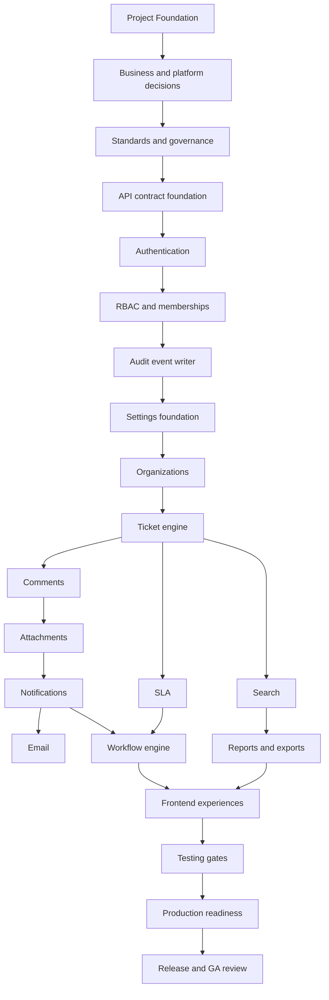

# Implementation order

This document defines the exact engineering sequence for [github-backlog.md](github-backlog.md). It is planning only. Do not start application code until implementation is explicitly approved.

## Dependency graph

## Hard gates

1. OQ-01, OQ-02, OQ-03, OQ-04, OQ-06, and OQ-12 must be resolved or explicitly accepted before irreversible M1 implementation.
2. OQ-07, OQ-09, and OQ-10 must be resolved before attachment and email implementation.
3. OQ-08 must be resolved before SLA policy implementation.
4. OQ-11 must be resolved before search implementation.
5. OQ-14 must be resolved before DR and GA readiness.

## Exact sequence

### Phase 0 - Planning approval

1. E01-I01 Resolve compliance and evidence baseline.
2. E01-I02 Resolve residency and deployment assumptions.
3. E01-I03 Approve engineering standards and repo structure.
4. E01-I04 Establish project governance gates.
5. E17-I01 Establish API contract and error envelope.
6. E19-I01 Establish unit and domain test harness.

### Phase 1 - Secure tenant and identity core

7. E02-I01 Design authentication module.
8. E04-I01 Implement permission catalogue.
9. E02-I02 Implement login, logout, and refresh flows.
10. E02-I03 Implement password reset and email verification.
11. E02-I04 Add MFA and session management baseline.
12. E04-I02 Implement roles, memberships, and groups.
13. E04-I03 Implement permission evaluator and cache invalidation.
14. E16-I01 Implement audit event writer.
15. E15-I01 Implement tenant settings foundation.
16. E04-I04 Build role and permission admin UI.
17. E19-I02 Establish tenant isolation and auth matrix tests.

### Phase 2 - Tenant organization and ticket foundation

18. E03-I01 Implement organization data model.
19. E03-I02 Implement organization APIs.
20. E03-I03 Build organization admin UI.
21. E05-I01 Implement ticket aggregate.
22. E05-I02 Implement ticket create/read APIs.
23. E05-I03 Implement ticket update and optimistic concurrency.
24. E05-I04 Implement assignment and transition commands.
25. E06-I01 Implement comment model.
26. E06-I02 Implement comments API.
27. E06-I03 Implement comment redaction policy.
28. E06-I04 Build comment composer and timeline UI.
29. E19-I03 Establish E2E and accessibility suites.

### Phase 3 - Attachments and communication

30. E07-I01 Implement attachment metadata and quarantine.
31. E07-I02 Implement upload session and completion APIs.
32. E07-I03 Implement scan callback and safe download.
33. E07-I04 Build attachment UI states.
34. E08-I01 Implement notification intent model.
35. E08-I02 Implement in-app notifications.
36. E08-I03 Implement notification preferences.
37. E09-I01 Implement email template model.
38. E09-I02 Implement outbound email provider adapter.
39. E09-I03 Implement inbound email processing.
40. E09-I04 Implement email domain/settings admin.
41. E08-I04 Implement delivery failure handling.

### Phase 4 - SLA and workflow automation

42. E10-I01 Implement business schedules.
43. E10-I02 Implement SLA policies and targets.
44. E10-I03 Implement SLA warnings and breaches.
45. E10-I04 Build SLA admin and ticket panel UI.
46. E11-I01 Implement workflow draft/version model.
47. E11-I02 Implement workflow validation and publishing.
48. E11-I03 Implement workflow execution engine.
49. E11-I04 Build workflow admin UI.

### Phase 5 - Search, reports, dashboards, and admin experience

50. E14-I01 Select search technology and indexing model.
51. E14-I02 Implement ticket search projection.
52. E14-I03 Implement search API.
53. E14-I04 Build search UI.
54. E13-I01 Implement report aggregate model.
55. E13-I02 Implement ticket and SLA report APIs.
56. E13-I03 Implement export jobs and downloads.
57. E16-I02 Implement audit query APIs.
58. E16-I03 Implement audit export evidence.
59. E03-I04 Add organization reporting hooks.
60. E13-I04 Build reporting UI.
61. E12-I01 Define dashboard metric contracts.
62. E12-I02 Build agent dashboard.
63. E12-I03 Build manager dashboard.
64. E12-I04 Build tenant admin health dashboard.

### Phase 6 - API hardening and frontend completion

65. E17-I02 Implement idempotency and concurrency primitives.
66. E17-I03 Implement rate limiting and abuse controls.
67. E17-I04 Generate and validate OpenAPI contract.
68. E18-I01 Establish frontend shell and component system.
69. E18-I02 Build requester portal flows.
70. E18-I03 Build agent workspace flows.
71. E18-I04 Build admin and auditor console flows.

### Phase 7 - Production readiness

72. E16-I04 Add audit integrity and alerting.
73. E15-I02 Implement branding, locale, and timezone settings.
74. E15-I03 Implement security and support access settings.
75. E15-I04 Implement quota and retention settings.
76. E20-I01 Establish deployment and environment strategy.
77. E20-I02 Implement observability and alerting baseline.
78. E20-I03 Implement backup, restore, retention, and DR readiness.
79. E19-I04 Establish performance, security, DR, and rollback suites.
80. E20-I04 Complete GA security and release review.

## Parallelization rules

- Documentation, test harness, and UI design can proceed ahead of implementation if they do not bypass dependency gates.
- Frontend work may start with contract mocks only after API contracts are approved.
- Search/report work cannot start until ticket/comment visibility rules are implemented.
- Email provider work cannot start until provider, domain, and deliverability decisions are approved.
- Production readiness begins early as planning but cannot pass until all release gates in [release-plan.md](release-plan.md) pass.
