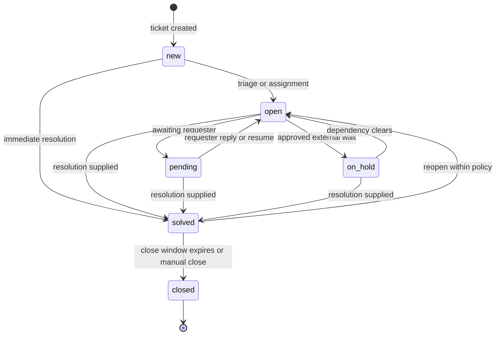

# Workflow matrix

This matrix expands [09-ticket-lifecycle.md](09-ticket-lifecycle.md), [10-sla.md](10-sla.md), and [notification-events.md](notification-events.md).

## Ticket state diagram

## Transition matrix

| From      | To        | Who can transition                                          | Required approvals                                    | SLA behavior                                                                             | Automation triggers                                                   | Notification events                 |
| --------- | --------- | ----------------------------------------------------------- | ----------------------------------------------------- | ---------------------------------------------------------------------------------------- | --------------------------------------------------------------------- | ----------------------------------- |
| none      | `new`     | Requester, Agent, Tenant Admin, inbound email worker        | None                                                  | Response and resolution targets start after policy selection.                            | `ticket.created`, `comment.created`, SLA selection, routing workflow. | Acknowledgement, new ticket alert.  |
| `new`     | `open`    | Agent, Manager, Tenant Admin, workflow                      | None unless tenant policy requires triage approval.   | Targets continue.                                                                        | Assignment/routing, priority rules.                                   | Assignment, status update.          |
| `new`     | `solved`  | Agent, Manager, Tenant Admin                                | Optional approval for internal-only resolution.       | Response target completes only if public agent response qualifies; resolution completes. | Closure checks, satisfaction scheduling.                              | Resolution supplied.                |
| `open`    | `pending` | Agent, Manager, Tenant Admin, workflow                      | None                                                  | Pauses configured targets only if policy says pending pauses.                            | Follow-up reminders, pending aging.                                   | Awaiting requester notice.          |
| `open`    | `on_hold` | Manager, Tenant Admin, approved Agent where policy allows   | Required when external wait exceeds tenant threshold. | Pauses configured targets only if policy allows.                                         | Hold review timer, escalation if expired.                             | Hold notice if public.              |
| `open`    | `solved`  | Agent, Manager, Tenant Admin                                | Approval if high-risk, regulated, or internal-only.   | Resolution target completes; response target may complete if public response qualifies.  | Satisfaction, close timer, report updates.                            | Ticket solved.                      |
| `pending` | `open`    | Requester reply, Agent, Manager, workflow                   | None                                                  | Resumes paused targets according to captured policy.                                     | Reassignment/escalation if overdue.                                   | Requester replied, ticket reopened. |
| `pending` | `solved`  | Agent, Manager, Tenant Admin                                | Same as solve policy.                                 | Resolution target completes.                                                             | Close timer.                                                          | Ticket solved.                      |
| `on_hold` | `open`    | Manager, Tenant Admin, workflow                             | None after dependency clears.                         | Resumes paused targets.                                                                  | Recalculate breach risk.                                              | Hold removed.                       |
| `on_hold` | `solved`  | Agent, Manager, Tenant Admin                                | Same as solve policy.                                 | Resolution target completes.                                                             | Close timer.                                                          | Ticket solved.                      |
| `solved`  | `open`    | Requester reply within window, Agent, Manager, Tenant Admin | Approval if outside reopen policy.                    | Reopen behavior follows captured SLA policy: restart, resume, or retain completion.      | Reopen routing, SLA recalculation if authorized.                      | Ticket reopened.                    |
| `solved`  | `closed`  | Timer, Agent, Manager, Tenant Admin                         | None unless manual close requires approval.           | Targets remain completed/final.                                                          | Archive/retention timers.                                             | Ticket closed.                      |
| `closed`  | any       | None                                                        | Not allowed                                           | No SLA changes.                                                                          | Follow-up creates linked ticket.                                      | Follow-up created if applicable.    |

## Workflow automation rules

- Workflows evaluate immutable domain-event snapshots.
- Published workflow versions execute in priority order.
- Workflow actions are bounded, deduplicated, and audited.
- Chained workflow execution has tenant-configured limits.
- Faulty workflows can be paused without deleting historical evidence.
- Workflows cannot run arbitrary customer code.

## Approval rules

Approval requirements are tenant-configured but must preserve these platform minimums:

- Security settings, role grants, workflow publication, SLA recalculation, audit export, operator elevation, and destructive bulk changes are approval-eligible.
- A user cannot approve their own privileged elevation.
- Approval decisions emit audit events.
